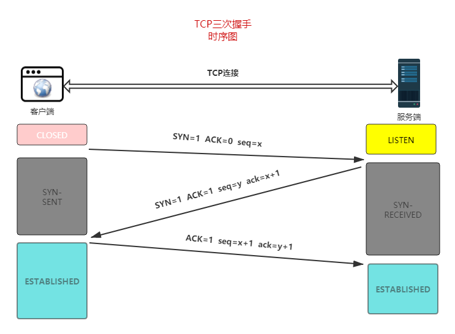

# tcp的三次握手和四次挥手

## 三次握手

三次握手`（Three-way Handshake）`其实就是指建立一个`TCP`连接时，需要客户端和服务器总共发送`3`个包。进行三次握手的主要作用就是为了确认双方的接收能力和发送能力是否正常、指定自己的初始化序列号为后面的可靠性传送做准备。实质上其实就是连接服务器指定端口，建立`TCP`连接，并同步连接双方的序列号和确认号，交换`TCP`窗口大小信息。

- 客户端：喂，听得到嘛，听到请回答
- 服务端：听到了，你听的到嘛
- 客户端：听的到，开始干吧

刚开始客户端处于 `Closed` 的状态，服务端处于 `Listen` 状态。
进行三次握手：

- 第一次握手：客户端给服务端发一个 `SYN` 报文，并指明客户端的初始化序列号 `ISN`。此时客户端处于 `SYN_SENT` 状态。首部的同步位`SYN=1`，初始序号`seq=x`，`SYN=1`的报文段不能携带数据，但要消耗掉一个序号。

- 第二次握手：服务器收到客户端的 `SYN` 报文之后，会以自己的 `SYN` 报文作为应答，并且也是指定了自己的初始化序列号 `ISN(s)`。同时会把客户端的 `ISN + 1` 作为`ACK` 的值，表示自己已经收到了客户端的 `SYN`，此时服务器处于 `SYN_RCVD` 的状态。服务器端将`TCP`报文标志位`SYN`和`ACK`都置为`1`,确认号`ack=x+1`，初始序号`seq=y`。

- 第三次握手：客户端收到 `SYN` 报文之后，会发送一个 `ACK` 报文，当然，也是一样把服务器的 `ISN + 1` 作为 `ACK` 的值，表示已经收到了服务端的 `SYN` 报文，此时客户端处于 `ESTABLISHED` 状态。服务器收到 `ACK` 报文之后，也处于 `ESTABLISHED` 状态，此时，双方已建立起了连接。确认报文段`ACK=1`，确认号`ack=y+1`，序号`seq=x+1`（初始为`seq=x`，第二个报文段所以要`+1`），`ACK`报文段可以携带数据，不携带数据则不消耗序号。

发送第一个`SYN`的一端将执行主动打开`（active open）`，接收这个`SYN`并发回下一个SYN的另一端执行被动打开`（passive open）`。
