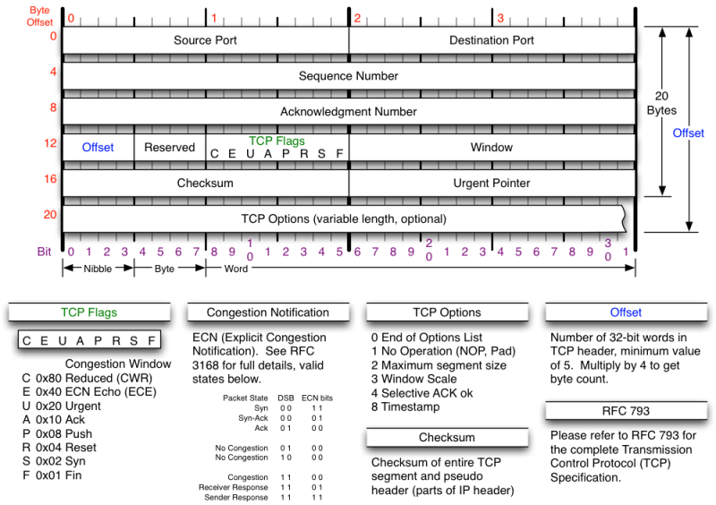
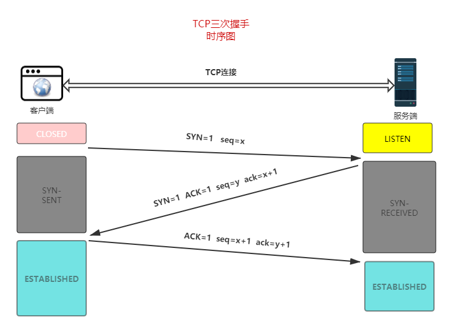
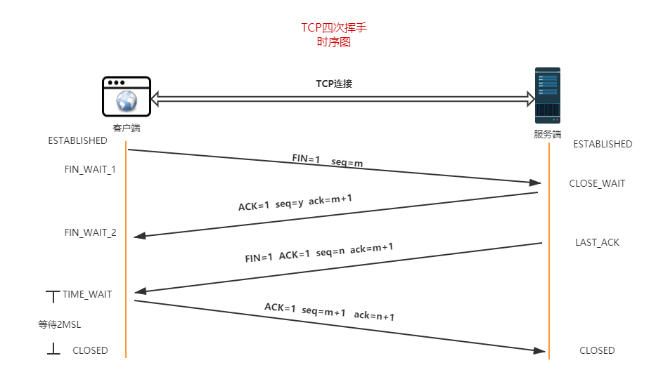

# TCP的三次握手和四次挥手

## TCP协议
`TCP`传输控制协议（`TCP，Transmission Control Protocol`）是一种面向连接的、可靠的、基于字节流的传输层通信协议，面向有连接是指在传送数据之前必须先建立连接，数据传送完成后要释放连接。

## TCP特性

- `TCP` 是面向连接的运输层协议。应用程序在使用 `TCP` 协议之前，必须先建立 `TCP` 连接。在传送数据完毕后，必须释放已经建立的 `TCP` 连接
- 每一条 `TCP` 连接只能有两个端点，每一条 `TCP` 连接只能是点对点的(一对一)
- `TCP` 提供可靠交付的服务。通过 `TCP` 连接传送的数据，无差错、不丢失、不重复，并且按序到达
- `TCP` 提供全双工通信。`TCP` 允许通信双方的应用进程在任何时候都能发送数据。`TCP` 连接的两端都设有发送缓存和接受缓存，用来临时存放双向通信的数据
- 面向字节流。`TCP` 中的“流”指的是流入到进程或从进程流出的字节序列
- `TCP` 使用滑动窗口机制来实现流量控制，通过动态改变窗口的大小进行拥塞控制

## TCP头部结构

上图中有几个字段需要重点介绍下：

- `TCP`端口号`TCP`的连接是需要四个要素确定唯一一个连接：（源`IP`，源端口号）+ （目地`IP`，目的端口号）所以`TCP`首部预留了两个16位作为端口号的存储，而IP地址由上一层`IP`协议负责传递源端口号和目地端口各占`16`位两个字节，也就是端口的范围是`2^16=65535`另外`1024`以下是系统保留的，从`1024-65535`是用户使用的端口范围
- `TCP`的序号和确认号：`32`位序号 `seq：Sequence number 缩写seq` ，`TCP`通信过程中某一个传输方向上的字节流的每个字节的序号，通过这个来确认发送的数据有序，比如现在序列号为`1000`，发送了`1000`，下一个序列号就是`2000`。`32`位确认号 `ack：Acknowledge number` 缩写`ack`，`TCP`对上一次`seq`序号做出的确认号，用来响应`TCP`报文段，给收到的`TC`P报文段的序号`seq加1`。
- `TCP`的标志位每个`TCP`段都有一个目的，这是借助于`TCP`标志位选项来确定的，允许发送方或接收方指定哪些标志应该被使用，以便段被另一端正确处理。用的最广泛的标志是 `SYN，ACK 和 FIN`，用于建立连接，确认成功的段传输，最后终止连接。

    *  `URG(URGent)` 当 `URG=1` 时，表明紧急指针字段有效。它告诉系统此报文段中有紧急数据，应尽快传送(相当于高优先级的数据)，而不是按原先的排队顺序来传送
    *  `ACK(ACKnowledgment)` 仅当 `ACK=1` 时确认号字段才有效。当 `ACK=0` 时，确认号无效。`TCP` 规定，在连接建立后所有传送的报文段都必须把 `ACK 置1`
    *  `PSH(Push)` 当两个应用进程进行交互式的通信时，有时在一端的应用进程希望在键入一个命令后立即就能够收到对方的响应
    *  `RST(ReSeT)` 当 `RST=1` 时，表明 `TCP` 连接中出现严重差错(如由于主机崩溃或其他原因)，必须释放连接，然后再重新建立运输连接
    *  `SYN(SYNnchronization)` 在连接建立时用来同步序号。当 `SYN=1` 而 `ACK=0` 时，表明这是一个连接请求报文段。对方若同意建立连接，则应在响应的报文段中使 `SYN=1` 和 `ACK=1`
    *  `FIN(FINis)` 用来释放一个连接。当 `FIN=1` 时，表明此报文段的发送发的数据已发送完毕，并要求释放运输连接

- `16位窗口大小（window size）`：是`TCP`流量控制的一个手段。这里说的窗口，指的是接收通告窗口（`Receiver Window，RWND`）。它告诉对方本端的`TCP`接收缓冲区还能容纳多少字节的数据，这样对方就可以控制发送数据的速度。

- `16位校验和（TCP checksum）`：由发送端填充，接收端对`TCP`报文段执行`CRC`算法以检验TCP报文段在传输过程中是否损坏。注意，这个校验不仅包括`TCP`头部，也包括数据部分。这也是`TCP`可靠传输的一个重要保障。

- `16位紧急指针（urgent pointer）`：是一个正的偏移量。它和序号字段的值相加表示最后一个紧急数据的下一字节的序号。因此，确切地说，这个字段是紧急指针相对当前序号的偏移，不妨称之为紧急偏移。`TCP`的紧急指针是发送端向接收端发送紧急数据的方法。我们将在后面讨论`TCP`紧急数据。

## 三次握手

三次握手`（Three-way Handshake）`其实就是指建立一个`TCP`连接时，需要客户端和服务器总共发送`3`个包。进行三次握手的主要作用就是为了确认双方的接收能力和发送能力是否正常、指定自己的初始化序列号为后面的可靠性传送做准备。实质上其实就是连接服务器指定端口，建立`TCP`连接，并同步连接双方的序列号和确认号，交换`TCP`窗口大小信息。

- 客户端：喂，听得到嘛，听到请回答
- 服务端：听到了，你听的到嘛
- 客户端：听的到，开始干吧

- `第一次握手`：客户端要向服务端发起连接请求，首先客户端随机生成一个起始序列号`ISN`(比如是`100`)，那客户端向服务端发送的报文段包含`SYN`标志位(也就是`SYN=1`)，序列号`seq=100`。

- `第二次握手`：服务端收到客户端发过来的报文后，发现`SYN=1`，知道这是一个连接请求，于是将客户端的起始序列号`100`存起来，并且随机生成一个服务端的起始序列号(比如是`300`)。然后给客户端回复一段报文，回复报文包含`SYN和ACK`标志(也就是`SYN=1,ACK=1`)、序列号`seq=300`、确认号`ack=101`(客户端发过来的序列号`+1`)。

- `第三次握手`：客户端收到服务端的回复后发现`ACK=1`并且`ack=101`,于是知道服务端已经收到了序列号为`100`的那段报文；同时发现`SYN=1`，知道了服务端同意了这次连接，于是就将服务端的序列号`300`给存下来。然后客户端再回复一段报文给服务端，报文包含`ACK标志位(ACK=1)`、`ack=301(服务端序列号+1)`、`seq=101`(第一次握手时发送报文是占据一个序列号的，所以这次`seq`就从`101`开始，需要注意的是不携带数据的`ACK`报文是不占据序列号的，所以后面第一次正式发送数据时`seq`还是`101`)。当服务端收到报文后发现`ACK=1并且ack=301`，就知道客户端收到序列号为`300`的报文了，就这样客户端和服务端通过`TCP`建立了连接。

## 四次挥手

四次挥手即终止`TCP`连接，就是指断开一个`TCP`连接时，需要客户端和服务端总共发送`4`个包以确认连接的断开。

刚开始双方都处于`ESTABLISHED` 状态，假如是客户端先发起关闭请求。四次挥手的过程如下：

挥手请求可以是客户端，也可以是服务端发起的，假设是客户端发起：

- `第一次挥手`：客户端向服务端发出连接释放报文(数据没发完时也可以发送连接释放报文并停止发送数据)，释放连接报文包含`FIN`标志位(`FIN=1`)、序列号`seq=m`。此时客户端发出FIN报文段后只是不能发数据了，但是还可以正常收数据；另外`FIN`报文段即使不携带数据也要占据一个序列号。此时客户端处于 `FIN_WAIT1` 状态。

- `第二次挥手`：服务端收到客户端发的`FIN`报文后,会发送 `ACK` 报文，`ACK`标志位(`ACK=1`)、把客户端的序列号值 `+1` 作为 `ACK` 报文的序列号值(`ack=m+1`)、序列号`seq=y`，表明已经收到客户端的报文了，此时服务端处于 `CLOSE_WAIT`(关闭等待) 状态，而不是立马给客户端发`FIN`报文，这个状态还要持续一段时间，因为服务端可能还有数据没发完。

- `第三次挥手`：服务端将最后数据发送完毕后就向客户端发出连接释放报文，报文包含`FIN和ACK`标志位(`FIN=1,ACK=1`)、确认号和第二次挥手一样`ack=m+1`、序列号`seq=n`。此时服务端处于 `LAST_ACK` 的状态。

- `第四次挥手`：客户端收到服务端发的`FIN`报文后，向服务端发出确认报文，且把服务端的序列号值 `+1` 作为自己 `ACK` 报文的确认号值，此时客户端处于 `TIME_WAIT` 状态。确认报文包含`ACK标志位(ACK=1)`、确认号`ack=n+1`、序列号`seq=m+1`。注意客户端发出确认报文后不是立马释放`TCP`连接，而是要经过`2MSL`(最长报文段寿命的2倍时长)后才释放`TCP`连接。而服务端一旦收到客户端发出的确认报文就会立马释放`TCP`连接，所以服务端结束`TCP`连接的时间要比客户端早一些。

### 为什么等待2MSL?

考虑丢包的问题，为了确保客户端第四次挥手的报文能够到达服务端。如果报文丢失，服务端会超时重发第三次挥手的报文，客户端再重新挥手一次确认，一来一回最长的时间就是`2MSL`，假设客户端不等待`2MSL`，而是在发送完`ACK`之后直接释放关闭，一但这个`ACK`丢失的话，服务器就无法正常的进入关闭连接状态。

## 参考文献
- [大佬把TCP三次握手四次挥手解释的这么明白](https://bbs.huaweicloud.com/blogs/170508)
- [面试官，不要再问我三次握手和四次挥手](https://yuanrengu.com/2020/77eef79f.html) 
- [一文彻底搞懂 TCP三次握手、四次挥手过程及原理](https://juejin.cn/post/6844904070000410631) 